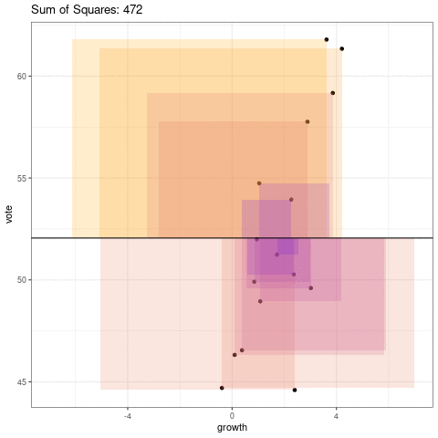

```{r setup, include=FALSE}
knitr::opts_chunk$set(echo = TRUE)
ggplot2::theme_set(ggplot2::theme_bw() + ggplot2::theme(strip.background = ggplot2::element_rect(fill = "white")))
```

# Learning Objectives

- Understand least squares objective and ordinary least squares (OLS) estimates.
- Derive OLS estimates using matrix notation.

# Data

- Consider the "bread and peace" data from Chapter 7 of [ROS](https://avehtari.github.io/ROS-Examples/).

    ```{r, message=FALSE}
    library(readr)
    library(ggplot2)
    hibbs <- read_csv("../data/hibbs.csv")
    qplot(x = growth, y = vote, data = hibbs)
    ```

# Visualization
    
```{r, echo = FALSE, eval = FALSE}
library(dplyr, warn.conflicts = FALSE)
library(tidyr, warn.conflicts = FALSE)
vote_mean <- mean(hibbs$vote)
growth_mean <- mean(hibbs$growth)
lmout <- lm(vote ~ growth, data = hibbs)
slope_max <- coef(lmout)[["growth"]]

slope_seq <- seq(0, slope_max, length.out = 25)
slope_seq <- c(slope_seq, rev(slope_seq))

pl_list <- list()
for (i in seq_along(slope_seq)) {
  slope <- slope_seq[[i]]
  hibbs %>%
    mutate(vote_center = vote - vote_mean,
           growth_center = growth - growth_mean,
           x1 = growth_center,
           y1 = slope * x1,
           x2 = x1,
           y2 = vote_center,
           diff = y1 - y2,
           x3 = x1 + diff,
           y3 = y2,
           x4 = x3,
           y4 = y1,
           x5 = x1,
           y5 = y1) %>%
    select(-year, 
           -growth, 
           -vote,
           -inc_party_candidate, 
           -other_candidate,
           -growth_center, 
           -vote_center) %>%
    mutate(obs = row_number()) %>%
    gather(-diff, -obs, key = "coord", value = "value") %>%
    separate(col = "coord", into = c("dim", "pos"), sep = 1) %>%
    spread(key = "dim", value = "value") %>%
    mutate(x = x + growth_mean,
           y = y + vote_mean,
           diff = abs(diff)) ->
    polydf
  
  polydf %>%
    select(diff, pos) %>%
    filter(pos == 1) %>%
    summarize(ss = sum(diff ^ 2)) %>%
    .$ss ->
    ss
  
  ggplot() +
    geom_point(data = hibbs, mapping = aes(x = growth, y = vote)) +
    geom_polygon(data = polydf, 
                 mapping = aes(x = x, y = y, group = obs, fill = diff), 
                 alpha = 1/5) +
    theme(legend.position = "none") +
    geom_abline(slope = slope, intercept = vote_mean - slope * growth_mean) +
    ylim(44.6, 61.8) +
    xlim(-7, 12) +
    ggtitle(paste0("Sum of Squares: ", round(ss))) +
    scale_fill_gradient(low = "blue", high = "orange", breaks = seq(0, 10, length = 10)) ->
    pl

  pl_list[[i]] <- pl
}

saveGIF(expr = {
  for (i in seq_along(pl_list)) {
    print(pl_list[[i]])
  }
}, movie.name = "ols.gif", interval = 0.1)
```



# Mathematical Derivation

# R Implementation


